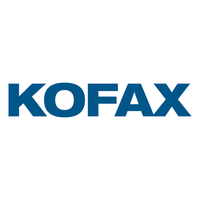
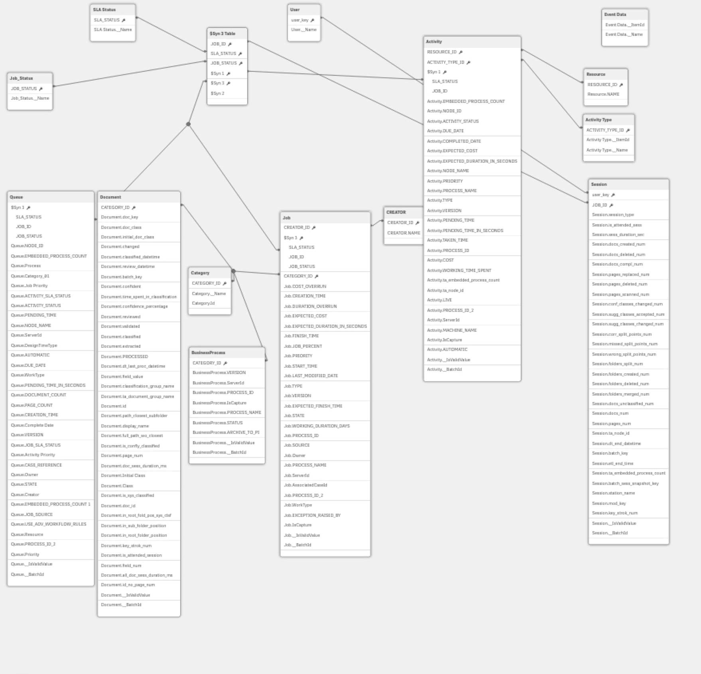
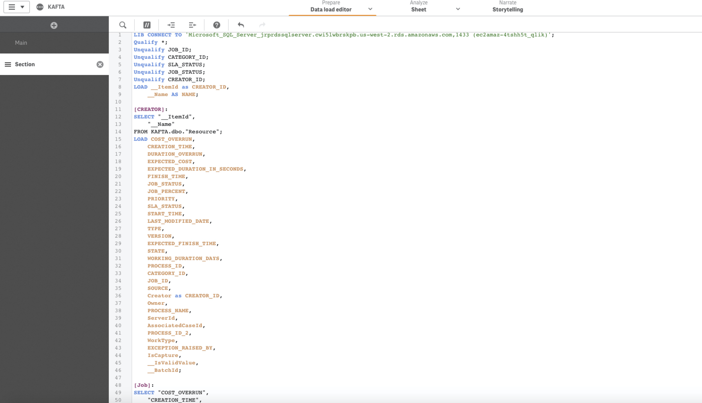
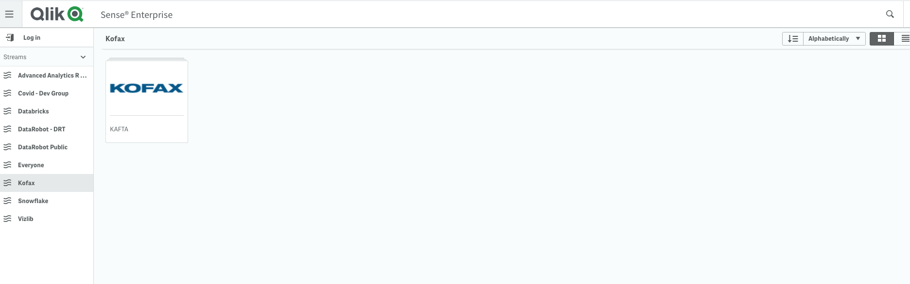
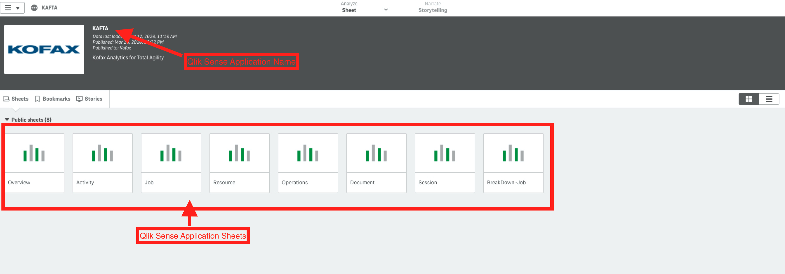
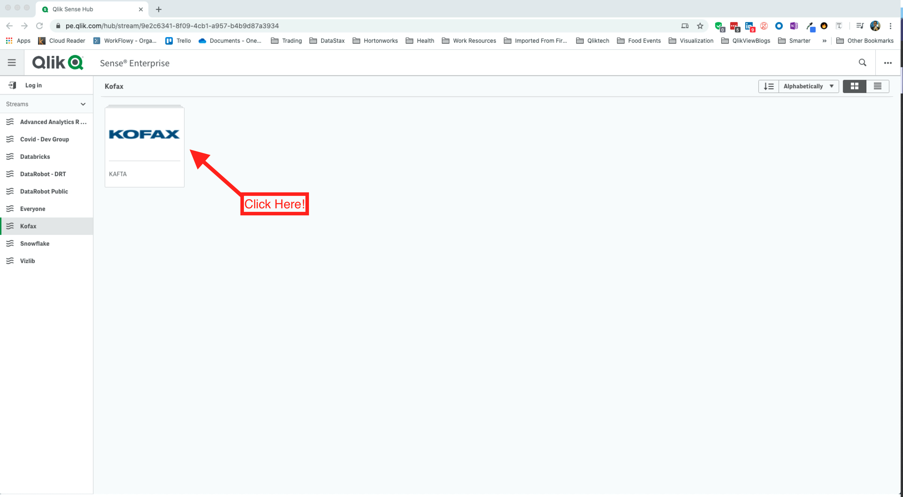
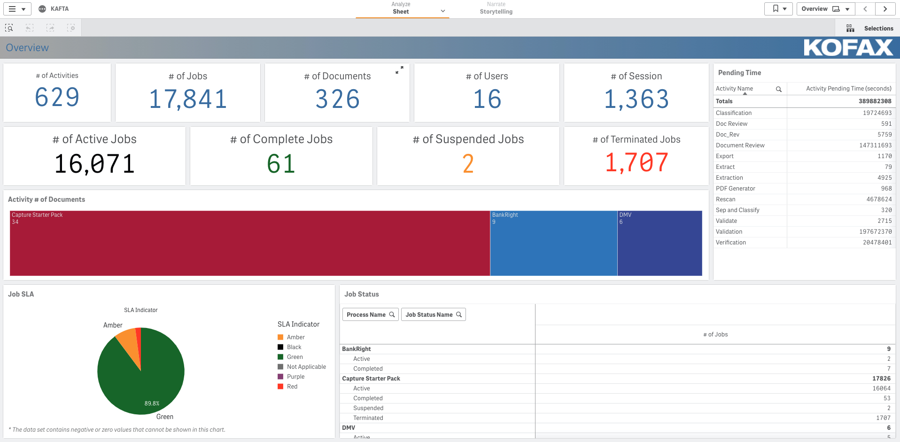
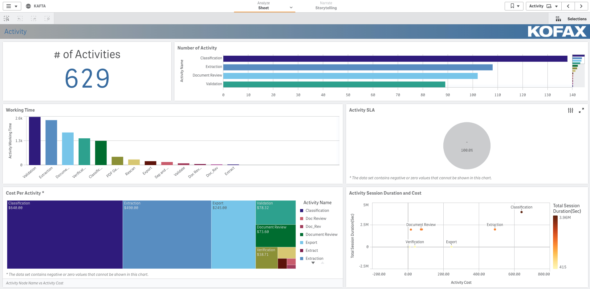
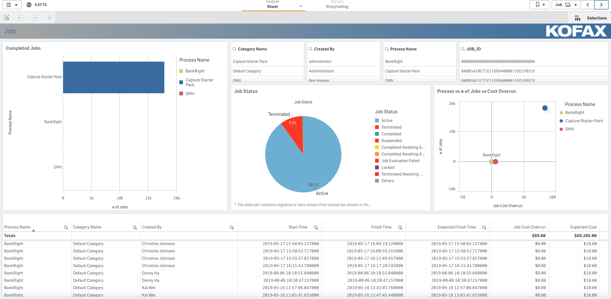
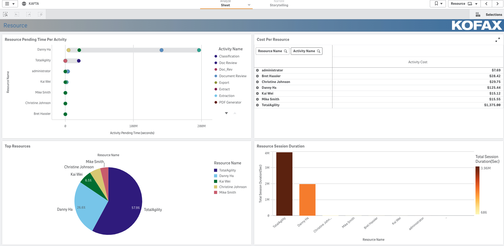

# **_Using Kofax Total Agility  Qlik Sense Application_**

## **Partner Engineering**

   
 
 
 

John Park  
Principal Solution Architect  
john.park@qlik.com  
  

**Version: 1.0**  
**Initial Release Date: 7-May-20**
**Revisions**      | **Notes**   | **Date**  | **Version**
------------------ | ----------- | --------- | -----------
Initial Draft      | 20-Apr-2020 | John Park | 0.1         |
Review of Language | 29-Apr-2020 | John Park | 0.2         |
Final Edit for V1  | 7-May-2020 | John Park | 1.0         |

# Table of Contents

--------------------

[**Summary**](#summary)  

[**Part 1 - Setup**](#part-1)

[**Part 2 - Data Model**](#part-2)

[**Part 3 - Viewing Data**](#part-3)

[**Part 4 - How to get started**](#part-4)

[**Part 5 - Testing and Additional Information**](#part-5)

## **Summary**

This document was created to supplement Qlik Sense and Kofax Total Agility Dashboard Initiative.

If you are a Kofax or Qlik Customer who would like more information please reach out to respective sales teams.

Kofax Total Agility is an advanced Process Automation Platform for customers
Please view the Kofax Total Agility website [here](https://www.kofax.com/Products/totalagility/overview).

Qlik Sense is a advanced data discovery and Business Intelligence Platform.  
  
The basis of this Documenation was taken from following:  

- Kofax Total Agility - [Kofax Total Agility Product Link](hhttps://www.kofax.com/Products/totalagility/overview)  
- Kofax Analytics For Total Agility - [Kofax Analytics For Total Agility Product Link](https://www.kofax.com/Products/process-intelligence/analytics-for-totalagility)  
- Qlik Sense - [Qlik Sense Help Link](https://help.qlik.com/en-US/sense)

## **Part 1**

### Setup

Qlik Sense must be installed for this solution we used Qlik Sense Enterprise Nov 2019 and Data from Kofax Total Agility 7.5 and Kofax Analytics for Total Agility 1.4.0

The Sample app was created from Data from Kofax Analytics from Total Agility.

Qlik Sense must be able to connect to RDBMS hosting this data and have access to data from the data model. Please verify the data is available before preceeding

## **Part 2**

### Data Model  

The Data  Model for this Qlik Sense app uses following base tables 

1. Resouce  
2. Job  
3. Activity  
4. Business Process
5. Category  
6. Document  
7. Event Data
8. Job Status  
9. Queue
10. Session
11. SLA Status  
12. User  
13. Activity Type

**_Below is the Data Model after the Data is loaded to Qlik Sense._**  
   
**_Below is a snippet fo the Script from Qlik Sense Data Load Editor._**

The Data is loaded using a Qlik Sense mechanism called Data Load Editor.  This process will load the data from Kofax Analytics for Total Agility into Qliks Associative Engine(QIX Engine) and associate the data based on metadata given from data source or manipulated by code.
Thie allows the user to click any field, chart and value to show relevant values in context.
Please look at this [link]( (https://www.qlik.com/us/products/associative-difference)) to view and understand how Qlik works when working with data.

#### For our integration with Kofak; Qlik Partner Engineering Team has made app availble for public testing as well as available to load into your own Qlik Enterprise server

The Samples Qlik app refered [How to get started](#part-4) can help you automatically load the data.

## **Part 3**

### Viewing Data

One the Data has been loaded in Qlik Sense via your connections.  
Qlik sense app will show the follwowing inside Qlik Sene Hub.  

You Sample Kofax App will lay out the data in the following with Application Name and Sheets.  Click on Any Sheets and start exploring your data.

## **Part 4**

### How to get started

To get started first take a look at Kofax Qlik Application hosted on Public facing Partner Engineering Qlik Application Server.

Link to Public [Kofax Qlik Application](https://pe.qlik.com/hub/stream/9e2c6341-8f09-4cb1-a957-b4b9d87a3934)

Partner Engineering Qlik Sense Server for Kofax Analytics for Total Agility(KAFTA) Application should look like the following:  

Once you Click on the Kofax Application you can see that Qlik Application Sheets are laid out in functional areas for easy navigation and intuitive understand of data.

Here are some screen captures of what the sheets look like:  

1. **Overview of Kofax Total Agility Processes:**

1. **Number of Activities Executed on Kofax Total Agility:**

1. **Number of Jobs Executed on Kofax Total Agility:**

1. **Resource Utilization on Kofax Total Agility:**
  

Navigate and test Fully functional Qlik Kofax Application by Clicking Data and Selections

Quick Links for Convenience
- Overview  - [Link](https://pe.qlik.com/sense/app/f529a75d-3897-4b47-a6e8-da5e659d164d/sheet/08fb2ef3-30a5-4882-87fa-a3ecc1ad231b/state/analysis)  
- Activities - [Link](https://pe.qlik.com/sense/app/f529a75d-3897-4b47-a6e8-da5e659d164d/sheet/a74ebfb3-c957-49f3-a811-02abdaa4c1f3/state/analysis)  
- Jobs - [Link](https://pe.qlik.com/sense/app/f529a75d-3897-4b47-a6e8-da5e659d164d/sheet/67255a83-33cf-4cdf-b7be-35d883e59bb6/state/analysis)  
- Resource - [Link](https://pe.qlik.com/sense/app/f529a75d-3897-4b47-a6e8-da5e659d164d/sheet/0103380b-991d-4117-9046-8384702d3d3e/state/analysis)  
- Operation  - [Link](https://pe.qlik.com/sense/app/f529a75d-3897-4b47-a6e8-da5e659d164d/sheet/bbd99c9d-6a0a-4d25-977d-7c399e0a2abe/state/analysis)
- Document  - [Link](https://pe.qlik.com/sense/app/f529a75d-3897-4b47-a6e8-da5e659d164d/sheet/1d5b3e1c-0090-4f62-a185-d4c4647781d7/state/analysis)
- Sessions - [Link](https://pe.qlik.com/sense/app/f529a75d-3897-4b47-a6e8-da5e659d164d/sheet/d5f5e900-4440-4dac-ab1c-0f67f00d3cec/state/analysis)
- BreakDown-Job  - [Link](https://pe.qlik.com/sense/app/f529a75d-3897-4b47-a6e8-da5e659d164d/sheet/39998bf9-3be3-4f46-a796-4ece5892ed4f/state/analysis)

## Download Sample App to your Qlik Sense Instance  

**Download Sample Kofax Qlik Application [here](./application/KAFTA.qvf).**

Following options for you to customize and test the application  

1. Customer that own Qlik Sense Enterprise - Upload Kofax Qlik App to Qlik Enterprise QMC(Qlik Management Console) via these [instructions](https://help.qlik.com/en-US/sense/June2019/Subsystems/ManagementConsole/Content/Sense_QMC/import-apps.htm)

1. Try our SaaS Servioce - Qlik Cloud Service(QCS) - Upload QCS via these [instructions](https://help.qlik.com/en-US/cloud-services/Subsystems/Hub/Content/Sense_Hub/Apps/create-app-cloud-hub.htm)

1. Qlik Sense Desktop(Expiring June 30th 2020) - Open Kofax Qlik Sense App on Qlik Sense Desktop via these [instructions](https://help.qlik.com/en-US/sense/April2020/Subsystems/Hub/Content/Sense_Hub/Apps/open-app-dt.htm)

## **Part 5**

### Testing and Additional Information

If you would like additional assistance with scripting, embedding and further use cases please contact Qlik Sales team for support.

If there are questions about how to use Qlik Please go to [Qlik's Website](www.qlik.com) to explore.  For further learning and discussions and view [Qlik Help Videos](https://help.qlik.com/en-US/videos) or post questions on [Qlik Community Site
](https://community.qlik.com/)

For Specific Kofax questions please refer to Kofax manuals or contact your sales teams.

Other Information can be found in [Qlik Community Site](https://community.qlik.com/t5/Technology-Partners-Ecosystem/ct-p/qlik-ecosystem "Qlik Technology Partner Eco System") in Technology Partner Sections where users can post questions and get them answered specific to this solution.